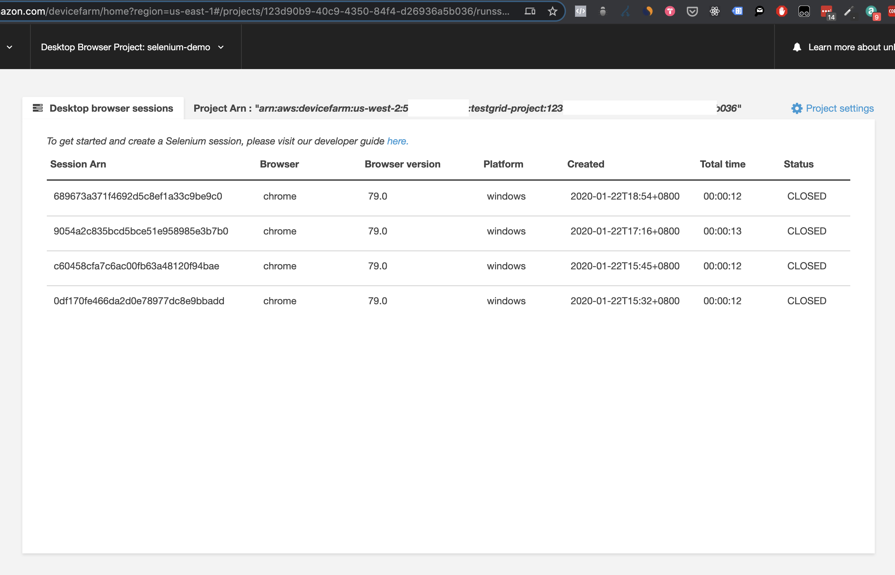
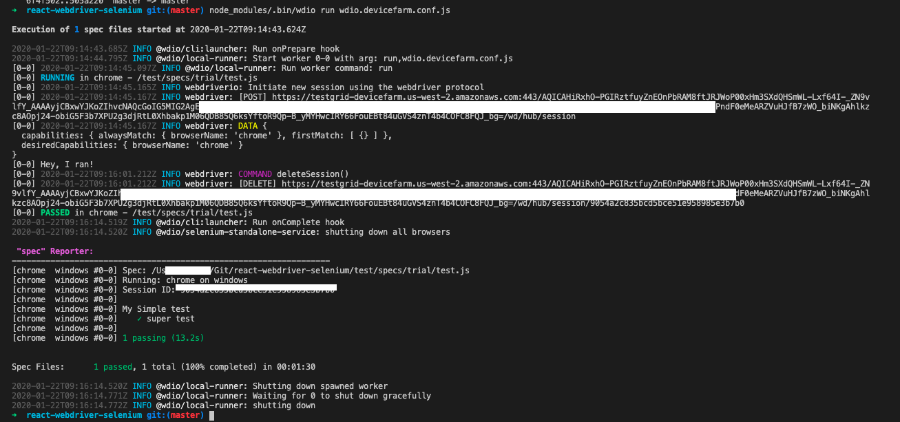
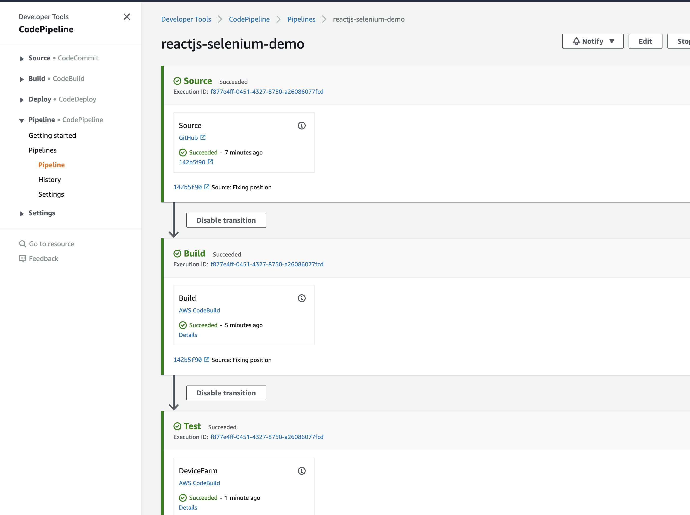

# Running Selenium Tests in AWS Device Farm

https://aws.amazon.com/about-aws/whats-new/2020/01/aws-device-farm-announces-desktop-browser-testing-using-selenium/

Notes for self:

```
yarn add chai webdriverio --dev
yarn add @wdio/selenium-standalone-service --dev
yarn add selenium-standalone --dev
yarn add jasmine --dev
yarn add @wdio/jasmine-framework --dev
yarn add wdio-spec-reporter --dev

npm install -g wdio

yarn add @wdio/cli --dev

node_modules/.bin/wdio run wdio.conf.js
```

## Setting of AWS Region

https://docs.aws.amazon.com/cli/latest/userguide/cli-configure-profiles.html

```
export AWS_DEFAULT_REGION=us-west-2
export AWS_PROFILE=defaultoregon
```

## Commands to run AWS Device Farm

https://docs.aws.amazon.com/devicefarm/latest/testgrid/testing-frameworks-nodejs.html

```
aws devicefarm list-projects
```

Refer to buildspec-test.yml for commands
Or refer to https://testgrid-devicefarm.us-west-2.amazonaws.com/

## AWS CodePipeline and CodeBuild

Attach IAM permission to codebuild, allow device farm commands

## Screenshots for reference






